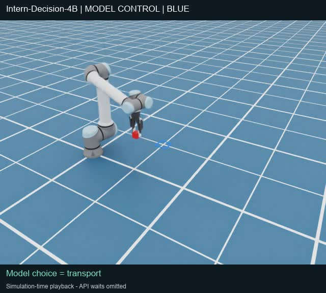

# 模型接管代表录像

**[观看蓝色接管视频](reports/candidate_48_video_20261007.html)** · [直接打开／下载MP4](videos/intern_dual_control_blue_20261007.mp4)

用户请求录像后，新增48蓝色接管一回合，2026-10-07 09:56:52–10:00:06 UTC完成；不是此前46回合的录像，也不是固定执行器重放。沿用已通过的41蓝／45黄在线shadow证据，未重跑shadow；模型、提示、技能和场景不变。

- Intern-Decision-4B中文空间描述＋实时双视角，7次新推理；官方choice直接执行，无错误、重试、abort或超时，物理抓放成功。
- 776物理更新，最终XY误差约2.20cm；218张原生PNG每3步采样，**20fps／10.9秒**，全部按原顺序编码，未插值、生成动作或剪选成功片段。
- 视频展示第一视角，模型仍接收两个视角。标注取自实际phase事件；自动retract与静置明确区分于模型选择的七个技能。
- **按仿真时间播放：省略API暂停等待和初始化预热，末尾未采样的2个物理步不在视频中。**实际运行约194秒，不能把短片时长称作实时控制耗时。
- 远端只采集PNG，本地FFmpeg编码H.264／yuv420p／faststart；画面未裁切，只在原画面上下增加文字栏。218帧、时长与完整解码检查通过。
- 模型／Isaac均已关闭，GPU计算进程为空。只录这一回合，不追加试验。

## 原始证据与复建

- [14张真实双视角输入／七份原响应／八概率HTML](reports/candidate_48_recording_20261007.html)
- [独立审计JSON](../test_reports/candidate_48_recording_audit_20261007.json) · [生命周期](../test_reports/candidate_48_recording_lifecycle_20261007.json) · [执行日志](../test_reports/candidate_48_recording_execution_20261007.txt)
- [运行前冻结计划](../test_reports/candidate_48_recording_plan_20261007.json) · [视频帧哈希／实际技能字幕／FFmpeg与ffprobe验证](../test_reports/candidate_48_video_verified_20261007.json) · [编码脚本](../test_reports/candidate_48_video_encode_20261007.py)

原始归档约131MB，超过Git单文件限制，分为三个保持原字节的块；**不是删除帧或重写证据**。[分块清单与哈希](../test_reports/candidate_48_recording_archive_parts_20261007.json)。按清单顺序连接后，原tar.gz SHA256为 `c36954922177e8dec264e9c764ddc19a5821c7a5881be38dc932c692f5ce4c94`。

录像入口独立启用IsaacScene原有录制参数，并在新计划／manifest中另行冻结哈希；原准入绑定的`run_candidate.py`与`visual_lab`源码未修改。36项录制／接管／监督相关CPU检查、12项离线审计回归通过；CPU检查不冒充真实GPU录像，实际结果来自上述Isaac原始证据。

[桌面／窄屏播放器检查](../test_reports/candidate_48_video_browser_verified_20261007.json)各6项通过，涵盖实际MP4尺寸／时长、H.264支持、控件、等待省略说明及布局。Chrome虚拟时间下的异步seek／play测试未完成，因此不宣称浏览器全程播放已验证；整段视频已用FFmpeg独立完整解码通过。
