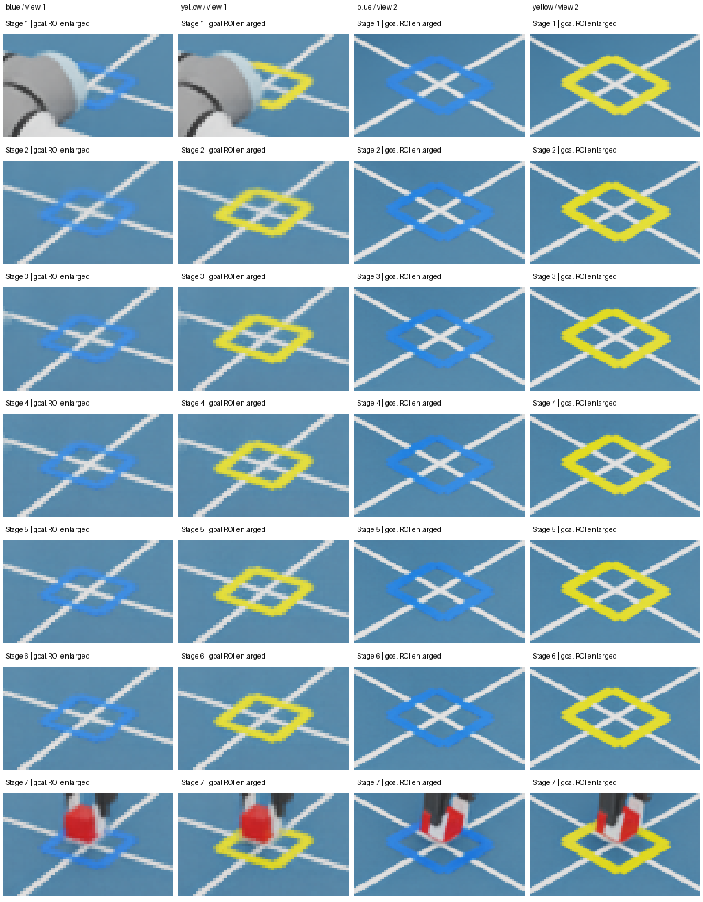
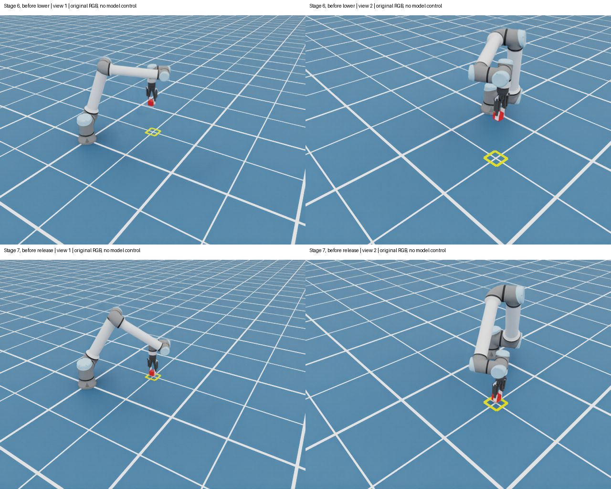

# 三因素八组合：真实GPU配对结果（2026-10-06）

**交互式离线报告：**[打开 HTML](reports/factorial_20261006.html)（单文件约15MB，内嵌28张原始PNG，无需模型服务或网络）。点击矩阵/阶段查看全部候选概率、实际state/questions、原始响应、相机图片，以及只改变一个因素的条件差值；支持导出56条CSV和当前请求/响应JSON。请求JSON为语义还原，原始文件字节哈希保留在来源区。

## 结论

**56次正式真实模型推理完成，但八组都没有解决最后的下降/释放判断。** 单视图四组均5/7；双视图无坐标辅助两组4/7，有坐标辅助两组5/7。这些是与固定baseline的七阶段一致项，不是模型控制成功率。

| 组合 | 框颜色 | 目标/工具距离辅助 | 视图 | baseline一致 | 最后两步一致 | 目标动作平均概率 |
|---|---|---|---:|---:|---:|---:|
| A0B0C0 | 蓝 | 无 | 1 | 5/7 | 0/2 | 33.92% |
| A0B0C1 | 蓝 | 无 | 2 | 4/7 | 0/2 | 34.58% |
| A0B1C0 | 蓝 | 有 | 1 | 5/7 | 0/2 | 35.86% |
| A0B1C1 | 蓝 | 有 | 2 | 5/7 | 0/2 | 36.26% |
| A1B0C0 | 黄 | 无 | 1 | 5/7 | 0/2 | 34.31% |
| A1B0C1 | 黄 | 无 | 2 | 4/7 | 0/2 | 35.32% |
| A1B1C0 | 黄 | 有 | 1 | 5/7 | 0/2 | 34.99% |
| A1B1C1 | 黄 | 有 | 2 | 5/7 | 0/2 | 35.56% |

固定执行序列：`pre_grasp → approach → grasp → lift → transport → lower → release`。

- 六个5/7组都建议：`pre_grasp → approach → grasp → lift → transport → transport → lift`。
- 蓝/无辅助/双图在第二步选 `grasp`；黄/无辅助/双图在第二步选 `pre_grasp`。其余建议与上述序列相同。
- 所有组的第六步选择 `transport` 而非 `lower`，第七步官方选择 `lift` 而非 `release`。
- **两组无辅助双图的第七步，`release` 与 `lift` 并列最高**；保留官方选择 `lift`，没有改平局规则、删候选或把并列算成功。

## 对三个想法的判断

1. **提高目标框与地板的颜色差异：实际渲染更清楚，但一致项没有增加。** 四种背景组合的颜色配对差值均为0项。黄色使第六步 `lower` 概率下降3.09–9.97个百分点，却使第七步 `release` 概率增加0.86–5.11个百分点；不能把“更显眼”直接等同于“更会选动作”。
2. **增加目标坐标与工具点距离：有局部帮助，但未修正最后两步。** 单视图仍5/7；双视图从4/7恢复为5/7，纠正的是第二步。四种背景下第六步 `lower` 概率都增加5.18–9.18个百分点，但仍不是argmax。B是目标配置/控制器模型FK辅助，不是纯视觉定位，也没有提供方块真值。
3. **双相机及方位说明：并非必然提升动作选择。** 无辅助时5/7降为4/7，有辅助时维持5/7；第七步 `release` 概率增加2.95–6.73个百分点，其中两组达到最高概率平局，但官方仍选 `lift`。推理中位耗时约从7.95秒增加至15.64秒。

七阶段目标动作概率的描述性平均主效应：颜色−0.11个百分点、目标辅助+1.14个百分点、第二视图+0.66个百分点。它们不是独立样本的统计显著性结果，也不是抓取成功概率。最大目标动作平均概率组为蓝/有辅助/双图，但它仍5/7且最后两步全错，**不能因此开放模型接管**。

## 如何控制变量

- A：原蓝 `[0.02,0.18,0.95]` / 亮黄 `[1.0,0.85,0.02]`，只改变目标框颜色；几何、2cm线宽、地板、光照和评分不变。
- B：无/有地面目标中心、lower技能工具目标、实测关节计算的模型 `tool0` 位置、位移、水平距离和高度差。地面中心为 `[0.5,0.5,0]`；工具放置目标Z约0.235m，不是地面Z或方块中心。全部阶段使用同一个实际lower目标，不发下一动作标签。
- C：同一第一张图 / 第一图加第二图。第一相机位置 `[1.8,-1.6,1.5]`，第二 `[1.7,1.4,1.3]`，均look_at `[0.65,0.25,0.2]`、640×480、18mm。视线方位/仰角分别约 `(121.866°,−30.829°)`、`(−132.397°,−35.237°)`；角度为相机到look_at的世界Z-up视线，不是像素坐标或已验证的物理标定。
- 所有组用同一颜色中性动作文字；单图也说明相机方位，双图仅再加第二张及其说明。A只变图片，B只增 `goal_guidance`，C只增第二图片/描述；56个实际请求逐组验证，不是只靠配置声称。
- 模型、权重来源、BF16、8192长度上限、温度1.99241824、八个候选和排序不变；没有截断。真实processor逐请求验证有序RGB哈希及图像网格数，单图/双图各28次。
- 模型输入来自白名单，不转发整个事件或配置；无方块真值、私有物理核验字段、阶段编号、期望动作、完整历史。

## GPU采集及失败记录

运行中换色的 `21_factorial_capture` 虽物理成功，但部分第一相机未可靠显示颜色变化；`22_factorial_replay` 主动中止，15个响应文件及在途请求记录保留，二者均标记 `INVALIDATED.json`，不作因素结论。额外渲染等待和新render product两个冻结诊断也未解决；具体RTX/Replicator根因仍未证明。

改用创建场景前固定颜色，分别执行同一固定轨迹：

- `23_static_blue_capture`、`24_static_yellow_capture`：两次均物理成功，各776次更新、七个同步双视图观测、无超时、最终XY误差0.0219928092m。
- 七阶段全部关节、机器人根/方块位姿、仿真时间、本体状态及工具目标完全一致，`25_static_paired_capture` 原字节合并28张PNG。
- 14对目标ROI像素检查通过，并目视逐对确认可见蓝/黄框边缘；批准凭据绑定snapshots和全部28图哈希。模型不接收裁剪、拼图或标注。
- `26_static_factorial_replay`：56/56真实响应完成，无替身或API错误；不启动机器人，不启动visual。单图耗时7.90–8.13秒，双图15.56–15.71秒；实际完整输入1666–2669 tokens，小于8192上限。

## 证据与边界

- [机器可读完整概率、条件配对差值、请求/响应及来源哈希](../test_reports/gpu_static_factorial_20261006.json)
- [GPU采集与批准记录](../test_reports/gpu_static_capture_20261006.json)
- [首轮失败及受控诊断](../test_reports/gpu_factorial_recovery_20261006.json)
- [200项CPU测试](../test_reports/unittest_static_recovery_20261006.txt)，[所选函数行覆盖](../test_reports/coverage_static_recovery_20261006.json)。CPU检查与上述真实GPU/权重推理是分开的证据。

远端原始数据位于 `/root/gpufree-share/isaac_visual_decision/runs/23_static_blue_capture` 至 `26_static_factorial_replay`；保留确切图片、请求、响应、模型/源码/配置哈希。采集源码提交为 `9fb6bf9`，正式重放运行源码未再修改。

本轮是**一个固定场景、七个相关状态的配对诊断**，不是56个独立任务，也不是模型自主抓放测试。共同文字/相机说明及静态渲染协议不同于历史 `20_prompt_shadow`，不能把历史分数差值归给某一因素。控制模型工具点未验证为精确物理抓取中心；距离仅作同参考点的模型辅助。后续可专门诊断lower/release或用未参与调参的新场景验证，当前不自动扩展实验、不开放visual控制。
